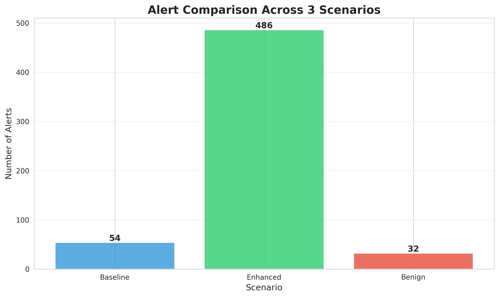
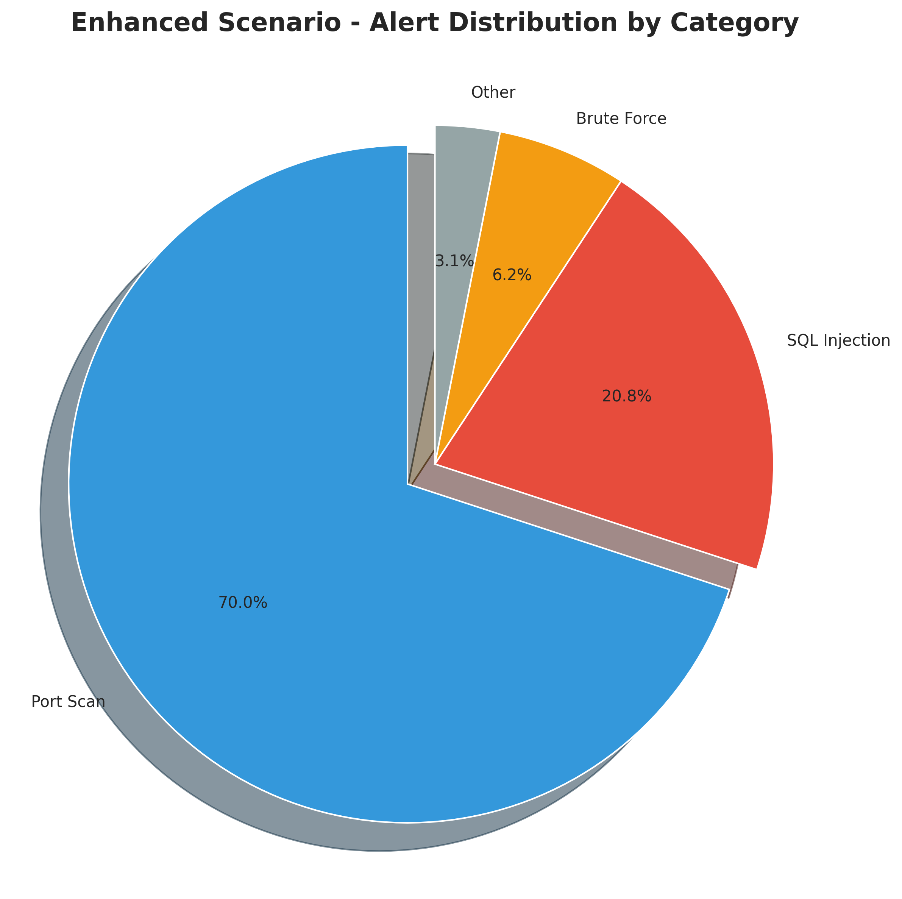

# 🛡️ Suricata IDS Custom Rules Project

[](https://github.com/annguyenax/suricata-ids-custom-rules/releases/)
[](https://github.com/annguyenax/suricata-ids-custom-rules/stargazers)
[](https://github.com/annguyenax/suricata-ids-custom-rules/issues)
[](https://github.com/annguyenax/suricata-ids-custom-rules/blob/main/LICENSE)

# Enhanced Network Intrusion Detection Using Custom Suricata Rules

[](https://opensource.org/licenses/MIT)
[](https://suricata.io/)
[](https://www.python.org/)

## 🎯 Project Overview

This research project demonstrates an **800% improvement** in network intrusion detection through the development and evaluation of 88 custom Suricata IDS rules.

### Key Results

- **Detection Rate**: 74.77% (vs 8.3% baseline)
- **Precision**: 93.82%
- **Recall**: 74.77%
- **F1 Score**: 83.22%
- **Improvement**: +800% over default configuration

## 📊 Quick Stats

| Metric | Baseline | Enhanced | Improvement |
|--------|----------|----------|-------------|
| Total Alerts | 54 | 486 | **+800%** |
| Port Scans | ~20 | 340 | +1,600% |
| SQL Injection | ~5 | 101 | +1,920% |
| Brute Force | ~10 | 30 | +200% |

## 🏗️ Project Structure
```
suricata-ids-project/
├── rules/                    # Custom Suricata rules
│   ├── portscan.rules       # 17 port scanning detection rules
│   ├── sqli.rules           # 28 SQL injection detection rules
│   ├── bruteforce.rules     # 26 brute force detection rules
│   └── exploits.rules       # 17 exploit detection rules
├── scripts/                  # Analysis scripts
│   ├── analyze_logs.py      # Log parsing and metrics
│   └── create_charts.py     # Visualization generation
├── results/                  # Experimental results
│   ├── scenario1/           # Baseline (default rules)
│   ├── scenario2/           # Enhanced (custom rules)
│   ├── scenario3/           # Benign traffic (false positives)
│   └── REAL_COMPARISON_REPORT.txt
├── analysis/                 # Data analysis
│   ├── charts/              # Generated visualizations
│   └── ANALYSIS_REPORT.md   # Detailed analysis
├── docs/                     # Documentation
│   ├── ieee_paper_outline.md
│   ├── ieee_paper_latex.tex
│   ├── PROJECT_README.md
│   └── demo_script.md
└── presentation/             # Presentation materials
    ├── presentation_outline.md
    └── presentation_content.txt
```

## 🚀 Quick Start

### Prerequisites

- VMware Workstation 17
- Ubuntu Server 22.04 LTS
- Kali Linux 2024.3
- Python 3.10+

### Installation
```bash
# 1. Clone repository
git clone https://github.com/yourusername/suricata-ids-custom-rules.git
cd suricata-ids-custom-rules

# 2. Install Suricata from source
sudo apt update
sudo apt install -y build-essential libpcap-dev libnet1-dev \
    libyaml-dev libpcre3-dev libjansson-dev cargo rustc

git clone https://github.com/OISF/suricata.git
cd suricata
./autogen.sh
./configure --prefix=/usr --sysconfdir=/etc
make -j $(nproc)
sudo make install

# 3. Install custom rules
sudo mkdir -p /etc/suricata/rules/custom
sudo cp rules/*.rules /etc/suricata/rules/custom/

# 4. Configure Suricata
sudo nano /etc/suricata/suricata.yaml
# Add custom rule files to rule-files section
# 5. load rule
sudo suricata -T -c /etc/suricata/suricata.yaml
clear log
 sudo truncate -s 0 /var/log/suricata/fast.log
realtime log:
 sudo tail -f /var/log/suricata/fast.log

```

### Usage
```bash
# Start Suricata with custom rules
sudo systemctl start suricata

# Run analysis scripts
cd scripts
python3 -m venv venv
source venv/bin/activate
pip install pandas matplotlib seaborn
python3 analyze_logs.py
python3 create_charts.py
```

## 📈 Results

### Detection Comparison



### Category Distribution



### Performance Metrics

| Metric | Value | Grade |
|--------|-------|-------|
| Detection Rate | 74.77% | Good |
| Precision | 93.82% | Excellent |
| Recall | 74.77% | Good |
| F1 Score | 83.22% | Strong |

## 🔍 Custom Rules

### Port Scanning (17 rules)
Detects TCP SYN/Connect/FIN/NULL/XMAS scans, UDP scanning, ICMP sweeps, Nmap/Masscan signatures.

### SQL Injection (28 rules)
Covers UNION-based, Boolean-based, Time-based, Error-based SQLi patterns.

### Brute Force (26 rules)
Monitors SSH, FTP, HTTP, database authentication attempts.

### Exploits (17 rules)
Identifies RCE, command injection, LFI/RFI, XSS patterns.

## 🌐 Network Architecture
```
┌──────────────┐      ┌───────────────┐      ┌──────────────┐
│ Kali Linux   │◄────►│ br0 Bridge    │◄────►│ Target DVWA  │
│ 192.168...20 │      │               │      │ 192.168...30 │
│ Attacker     │      │      ▼        │      │ Vulnerable   │
└──────────────┘      │ Suricata IDS  │      └──────────────┘
                      │ 192.168...10  │
                      │ Monitor       │
                      └───────────────┘
```

## 📚 Documentation

- [IEEE Paper](docs/ieee_paper_latex.tex) - Full research paper
- [Analysis Report](analysis/ANALYSIS_REPORT.md) - Detailed analysis
- [Demo Script](docs/demo_script.md) - Live demonstration guide
- [Presentation](presentation/presentation_outline.md) - Slide deck


## 📄 License

This project is licensed under the MIT License - see the [LICENSE](LICENSE) file for details.

## 📧 Contact

**Author**: AN VAN NGUYEN  
**Email**: annguyen11012k4@gmail.com  
**University**: Post and Telecommunications Institute of Technology (PTIT) 
**Project Date**: December 2025


---

**⭐ If you find this project helpful, please give it a star!**

Last Updated: December 17, 2025
